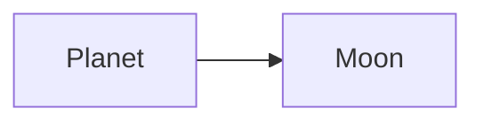

# Solardemo SDKs

Generated client SDKs for the Solardemo API, produced from a single model by
the generator in [`.sdk/`](.sdk). See [`AGENTS.md`](AGENTS.md) for how to build
and regenerate them.

## SDKs

- **TypeScript** — [`ts/`](ts) ([usage](ts/AGENTS.md), [README](ts/README.md))
- **Golang** — [`go/`](go) ([usage](go/AGENTS.md), [README](go/README.md))

## API entities

- **Moon** (`moon`) — create, list, load, remove, update
- **Planet** (`planet`) — create, list, load, remove, update

## Test server

A standalone REST server — used to develop and validate the SDKs — lives in
[`app/`](app). It is **separate** from the SDKs; see
[`app/AGENTS.md`](app/AGENTS.md).
